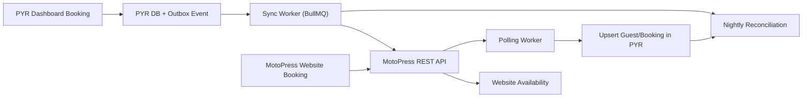

# MotoPress Integration Plan

Last updated: 2026-03-03
Status: In progress (Phase A)

## Current MVP Mode (Implemented)

1. Manual sync only (`no automatic sync worker yet`).
2. Booking detail page has a `Sync to MotoPress` button.
3. Rooms settings include `MotoPress Room Mapping` UI.
4. Sync fails fast if a room is not mapped.
5. Rooms settings include `Import from MotoPress` (creates/updates room types, rooms, and mappings).

## Scope

Sync bookings and availability between PYR and a MotoPress-powered WordPress site (GoDaddy-hosted), with reliability-first behavior:

1. Outbound sync: `PYR -> MotoPress` for changes made in PYR.
2. Inbound sync: `MotoPress -> PYR` via scheduled polling.
3. Reconciliation: nightly drift detection and repair.

No WordPress push plugin in MVP.

## Non-Goals (MVP)

1. No custom WordPress webhook bridge plugin.
2. No two-way room/rate master-data authoring yet (bookings only).
3. No automatic conflict resolution for ambiguous multi-accommodation bookings.

## Canonical References

1. MotoPress REST API docs: https://motopress.github.io/hotel-booking-rest-api/
2. MotoPress REST API OpenAPI source: https://github.com/motopress/hotel-booking-rest-api
3. WordPress plugin package/source: https://downloads.wordpress.org/plugin/motopress-hotel-booking-lite.zip

## Architecture (MVP)

## Global Quality Gates

1. All new modules have unit/integration tests.
2. No silent failures: retry, dead-letter, or visible failed status.
3. Structured logs include `bookingId`, `externalBookingId`, `syncVersion`.
4. `pnpm --filter @pyr/backend type-check` is clean.

## Phase A — Foundation

### Requirements

- [x] Add MotoPress env configuration with validation defaults.
- [x] Add DB fields for booking sync metadata.
- [x] Add DB table for room external mapping.
- [x] Add typed MotoPress API client with schema validation and timeout handling.
- [x] Add admin API for room mapping CRUD.
- [x] Add API endpoint to list MotoPress accommodations for mapping UI.

### Verifiable Tests

- [x] MotoPress client parses valid booking list payload.
- [x] MotoPress client rejects invalid payload schema.
- [x] MotoPress client surfaces non-2xx as typed HTTP error.
- [x] MotoPress client times out and aborts request.
- [x] Room mapping API supports create/list/update and enforces uniqueness.
- [x] Migration applies and constraints/indexes exist in local DB.

### Exit Gate

- [x] Backend type-check passes.
- [x] `db:migrate` + `db:generate` complete successfully.
- [ ] Credentials smoke test (`GET /bookings?per_page=1`) works against target site.

## Phase B — Outbound Sync (`PYR -> MotoPress`)

### Interim Delivery (Done)

- [x] Manual endpoint `POST /api/v1/bookings/:id/sync/motopress`.
- [x] Manual UI action in booking detail.
- [x] Sync status persisted on booking (`syncStatus`, `syncError`, `lastSyncedAt`).

### Requirements

- [ ] Transactional outbox on booking create/update/cancel.
- [ ] Worker sends create/update/cancel calls to MotoPress.
- [ ] Retry policy (exponential), then dead-letter.
- [ ] Idempotency by `bookingId + syncVersion`.
- [ ] Manual retry endpoint for failed sync.

### Verifiable Tests

- [ ] Rollback test: no outbox event if booking transaction fails.
- [ ] Create in PYR creates exactly one MotoPress booking.
- [ ] Duplicate worker execution does not create duplicates remotely.
- [ ] Failure path retries and dead-letters after max attempts.
- [ ] Manual retry transitions failed item to synced.

### Exit Gate

- [ ] PYR booking blocks website availability within 60 seconds (integration test).
- [ ] Duplicate remote booking count remains zero under retry/restart simulation.

## Phase C — Inbound Polling (`MotoPress -> PYR`)

### Requirements

- [ ] Poll changed bookings every `MOTOPRESS_SYNC_INTERVAL_MINUTES`.
- [ ] Cursor-based incremental ingestion.
- [ ] Upsert booking/guest by `externalBookingId`.
- [ ] Dedupe by payload hash or remote modified timestamp.

### Verifiable Tests

- [ ] First poll imports new website bookings.
- [ ] Second poll with same payload is idempotent.
- [ ] Remote booking update is reflected in PYR.
- [ ] Invalid payload marks item for review, worker continues.
- [ ] Cursor recovery test passes after simulated restart.

### Exit Gate

- [ ] Website booking appears in PYR within one poll interval.
- [ ] Re-running poll on same window does not duplicate data.

## Phase D — Reconciliation + Observability

### Requirements

- [ ] Nightly reconciliation for future bookings + recent window.
- [ ] Safe auto-heal, unsafe drift marked `needsReview`.
- [ ] Sync status API/dashboard card.
- [ ] Alerts for stale/failed sync backlog.

### Verifiable Tests

- [ ] Drift detection catches missing/mismatched records.
- [ ] Auto-heal repairs safe drift.
- [ ] Alert triggers on synthetic stale failures.
- [ ] Status API returns correct counts and lag.

### Exit Gate

- [ ] Reconciliation report shows no unresolved critical drift.

## Phase E — Hardening and Runbook

### Requirements

- [ ] Secret handling and redaction in logs.
- [ ] Circuit breaker around MotoPress API failures.
- [ ] Runbook for key rotation and dead-letter replay.
- [ ] Feature flag to pause outbound sync safely.

### Verifiable Tests

- [ ] Timeout/circuit-breaker behavior tests.
- [ ] Dead-letter replay test.
- [ ] Pause-flag prevents outbound writes while keeping local changes.

### Exit Gate

- [ ] 10+ minute MotoPress outage test completes with no data loss.
- [ ] Recovery replay catches up all pending sync tasks.

## UAT Checklist

- [ ] Create booking in PYR -> website availability blocks.
- [ ] Cancel booking in PYR -> website availability unblocks.
- [ ] Create booking on website -> appears in PYR.
- [ ] Simulate MotoPress outage -> retries/dead-letter/alerts behave as expected.
- [ ] Run nightly reconciliation -> no critical unresolved mismatches.

## Open Inputs Needed From Ines

1. WordPress site URL and exact MotoPress REST base URL.
2. MotoPress API key pair (`consumer_key`, `consumer_secret`) for a dedicated integration user.
3. Initial room mapping table (MotoPress accommodation IDs to PYR room IDs).
4. Preferred acceptable sync lag (default is 5 minutes).
