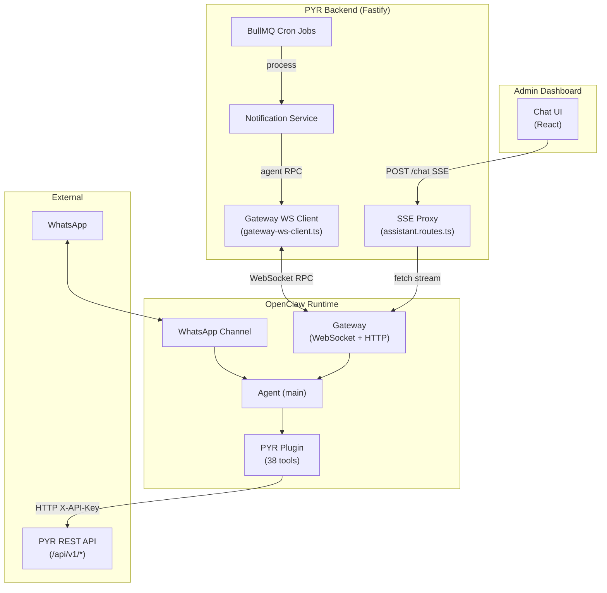
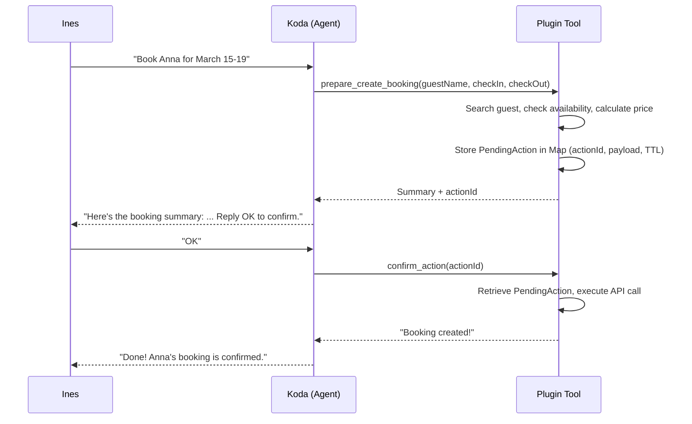
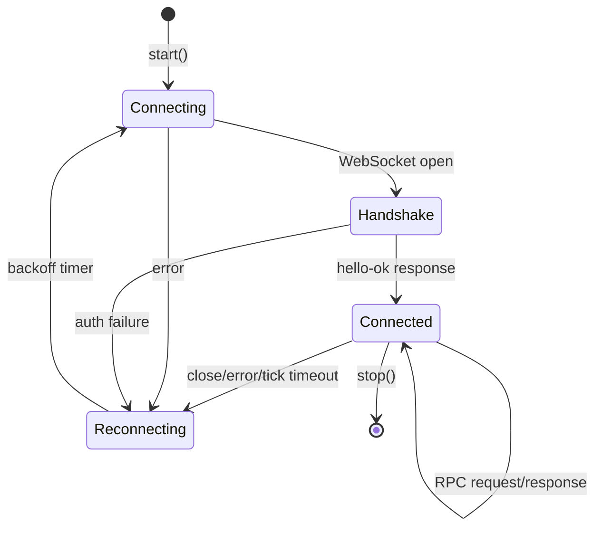
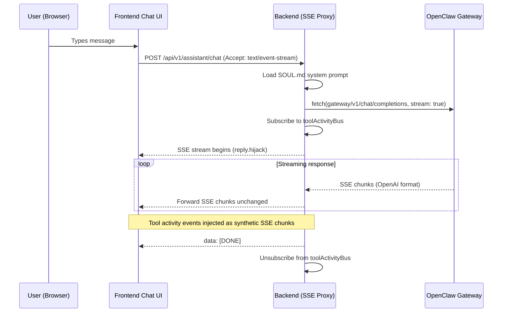

# Assistant & OpenClaw Integration Architecture

## Overview

The PYR AI assistant runs on [OpenClaw](https://openclaw.dev) as its runtime, providing Ines with a conversational business assistant accessible via the admin dashboard chat (WebChat) and WhatsApp. The OpenClaw plugin exposes 38 tools that map to PYR REST API endpoints, enabling the assistant to read business data, create/update/cancel entities with two-step confirmation, manage email drafts, and update settings.

The backend communicates with the OpenClaw Gateway via a persistent WebSocket connection for real-time chat streaming, notification delivery, and scheduled briefings.

## Integration Architecture



## Component Map

| Component | Location | Purpose |
|-----------|----------|---------|
| OpenClaw Plugin | `packages/assistant/openclaw-plugin/` | 38 tools for PYR REST API access |
| Gateway WS Client | `packages/backend/src/services/gateway/` | Persistent WebSocket to OpenClaw Gateway |
| Assistant Routes | `packages/backend/src/modules/assistant/` | SSE proxy for dashboard chat (HTTP API) |
| Notification Service | `packages/backend/src/modules/notifications/` | Morning briefing, alerts, delivery via gateway |
| Workspace Config | `openclaw/` | SOUL.md persona, skills, cron jobs, openclaw.json config |
| Confirmation Library | `packages/assistant/openclaw-plugin/lib/confirmation.ts` | In-memory pending action store with TTL cleanup |
| API Client | `packages/assistant/openclaw-plugin/lib/api-client.ts` | HTTP client for PYR backend (X-API-Key auth) |

## File Structure

```
packages/assistant/
  openclaw-plugin/
    index.ts                    # Plugin entry point -- registers all 38 tools
    openclaw.plugin.json        # Plugin metadata and config schema
    lib/
      api-client.ts             # HTTP client for PYR backend REST API
      confirmation.ts           # In-memory pending action Map with TTL cleanup
      formatters.ts             # Date, currency, status formatting helpers
    tools/
      guests.ts                 # 7 tools: search, get, list, create, update, delete, merge
      bookings.ts               # 4 tools: list, get, update, cancel
      rooms.ts                  # 3 tools: list rooms, list types, check availability
      events.ts                 # 6 tools: list, get, registrations, update, delete, register
      conversations.ts          # 3 tools: list, get, update (direct)
      dashboard.ts              # 2 tools: stats, today schedule
      settings.ts               # 2 tools: get (safe keys), update (writable keys)
      actions.ts                # 6 tools: create booking, create event, confirm, cancel, invoice, briefing time
      drafts.ts                 # 5 tools: list pending, show, approve, regenerate, reject
    __tests__/
      check-availability.test.ts

packages/backend/src/
  services/gateway/
    gateway-ws-client.ts        # Persistent WebSocket client (auto-reconnect, RPC, chat events)
    types.ts                    # RPC frame types for Gateway protocol v3
    gateway-ws-client.test.ts   # Unit tests
  modules/assistant/
    assistant.routes.ts         # POST /chat (SSE proxy), POST /chat/reset
    assistant.schema.ts         # Zod schemas for chat request/response
    assistant.test.ts           # Integration tests
  modules/notifications/
    notification.service.ts     # Briefing builder, alert formatters, gateway delivery
    notification.types.ts       # AlertType union, BriefingData interface

openclaw/
  openclaw.json                 # Full OpenClaw workspace config (agents, hooks, channels, plugins)
  workspace/
    SOUL.md                     # Koda persona -- system prompt (assistant + email draft modes)
    AGENTS.md                   # Agent configuration
    TOOLS.md                    # Tool documentation
    skills/                     # Domain skills (availability, bookings, guests, etc.)
  cron/
    jobs.json                   # OpenClaw-managed cron jobs (currently empty -- PYR uses BullMQ)
  plugins/
    pyr-assistant/              # Symlink target for plugin mount
```

## Tool Reference

### Guests (7 tools)

| Tool | Description | Confirmation |
|------|-------------|-------------|
| `search_guests` | Search by name, email, or phone | No -- read-only |
| `get_guest` | Get guest with booking history and conversations | No -- read-only |
| `list_guests` | List recent guests | No -- read-only |
| `prepare_create_guest` | Prepare new guest with duplicate detection | Yes |
| `prepare_update_guest` | Prepare guest update with before/after diff | Yes |
| `prepare_delete_guest` | Prepare soft-delete (archive) | Yes |
| `prepare_merge_guests` | Prepare merge of duplicate guest records | Yes |

### Bookings (4 tools)

| Tool | Description | Confirmation |
|------|-------------|-------------|
| `list_bookings` | List with status/date filters | No -- read-only |
| `get_booking` | Full booking details with guest and room | No -- read-only |
| `prepare_update_booking` | Prepare update with before/after diff | Yes |
| `prepare_cancel_booking` | Prepare cancellation with summary | Yes |

### Rooms (3 tools)

| Tool | Description | Confirmation |
|------|-------------|-------------|
| `list_rooms` | All rooms with status and type | No -- read-only |
| `list_room_types` | Room categories with pricing | No -- read-only |
| `check_availability` | Available rooms for date range with pricing | No -- read-only |

### Events (6 tools)

| Tool | Description | Confirmation |
|------|-------------|-------------|
| `list_events` | List with date range filter | No -- read-only |
| `get_event` | Full event details with capacity info | No -- read-only |
| `list_event_registrations` | Registered guests for an event | No -- read-only |
| `prepare_update_event` | Prepare event update with diff | Yes |
| `prepare_delete_event` | Prepare permanent deletion with warning | Yes |
| `prepare_register_guest` | Search guest, check capacity, register | Yes |

### Conversations (3 tools)

| Tool | Description | Confirmation |
|------|-------------|-------------|
| `list_conversations` | Inbox with status filter | No -- read-only |
| `get_conversation` | Full message thread | No -- read-only |
| `update_conversation` | Change status or classification | No -- direct (reversible) |

### Dashboard (2 tools)

| Tool | Description | Confirmation |
|------|-------------|-------------|
| `get_dashboard_stats` | Business KPIs (inquiries, revenue, guests) | No -- read-only |
| `get_today_schedule` | Today's check-ins, check-outs, events | No -- read-only |

### Settings (2 tools)

| Tool | Description | Confirmation |
|------|-------------|-------------|
| `get_settings` | Non-sensitive settings (SAFE_KEYS allowlist) | No -- read-only |
| `update_setting` | Update writable settings (WRITABLE_KEYS guard) | No -- direct (reversible) |

### Actions (6 tools)

| Tool | Description | Confirmation |
|------|-------------|-------------|
| `prepare_create_booking` | Search guest, check availability, calculate price | Yes |
| `prepare_create_event` | Validate type, set capacity | Yes |
| `confirm_action` | Execute a pending action after user confirms | N/A (executes) |
| `cancel_action` | Discard a pending action | N/A (cancels) |
| `send_invoice_reminder` | Surface overdue bookings for manual follow-up | No -- read-only |
| `update_briefing_time` | Change morning briefing delivery time | No -- direct |

### Drafts (5 tools)

| Tool | Description | Confirmation |
|------|-------------|-------------|
| `list_pending_drafts` | Pending AI email drafts across conversations | No -- read-only |
| `show_draft` | Full draft content with To, Subject, Body | No -- read-only |
| `approve_draft` | Queue draft for sending | Yes |
| `regenerate_draft` | Discard and regenerate fresh draft | No -- direct |
| `reject_draft` | Reject draft immediately | No -- direct |

**Summary:** 17 read-only + 16 action (confirmation required) + 5 draft management = 38 tools total.

## Confirmation Flow

All destructive write operations use a two-step confirmation pattern:



**How it works:**
1. `prepare_*` tools validate input, check availability/duplicates, and store a `PendingAction` in an in-memory `Map`
2. The tool returns a structured summary and an `actionId` to the LLM
3. The LLM presents the summary to Ines and asks for confirmation
4. On "OK/yes/go ahead": `confirm_action` retrieves the PendingAction by ID and executes the actual API call
5. On "cancel/no/stop": `cancel_action` removes the PendingAction from the Map

**PendingAction storage:**
- In-memory `Map<string, PendingAction>` -- ephemeral, single-instance
- TTL-based cleanup: stale actions (> 1 hour) cleaned up opportunistically during `confirm_action` / `cancel_action`
- Lost on Gateway restart (by design -- single-user, Ines can re-request)
- Action types: 14 variants covering guests, bookings, events, conversations, and drafts

**Direct execution (no confirmation):**
- `update_conversation` -- status/classification changes are easily reversible
- `update_setting` -- non-sensitive settings, WRITABLE_KEYS guard prevents credentials
- `reject_draft` and `regenerate_draft` -- non-destructive draft management

## Gateway WebSocket Client

`GatewayWsClient` (`packages/backend/src/services/gateway/gateway-ws-client.ts`) maintains a persistent WebSocket connection to the OpenClaw Gateway using RPC protocol v3.

### Connection Lifecycle



### Key Design Decisions

- **Non-blocking startup:** `start()` resolves even if the gateway is unreachable. Reconnect logic handles retry. Fastify startup is never blocked.
- **Auto-reconnect with exponential backoff:** Starting at 3 seconds, doubling up to 30 seconds max, with +/-25% jitter to prevent thundering herd.
- **Tick timeout:** If no message arrives within 2x the gateway's `tickIntervalMs` (from hello-ok policy), the connection is considered dead and force-reconnected.
- **Health check is informational:** `isConnected` returns current status but does not block overall `/health` endpoint. A disconnected gateway degrades chat and notifications but does not take down the backend.
- **Chat event routing:** `onChatEvent(handler)` returns an unsubscribe function. Multiple concurrent listeners are supported (e.g., dashboard chat + draft generation simultaneously).

### RPC Methods Used

| Method | Caller | Purpose |
|--------|--------|---------|
| `connect` | Handshake | Authenticate with token, negotiate protocol v3 |
| `chat.send` | Assistant routes | Send user message, receive streaming response |
| `agent` | Notification service | Deliver briefings, alerts, generate drafts |
| `sessions.reset` | Chat reset endpoint | Start fresh conversation session |

## Dashboard Chat Flow



**Key implementation details:**
- Backend proxies the Gateway's OpenAI-compatible HTTP streaming API (`/v1/chat/completions`)
- SSE format preserved exactly: `choices[0].delta.content` for text, `choices[0].delta.tool_calls` for tool indicators
- `reply.hijack()` gives raw socket control for streaming without Fastify response serialization
- Tool activity indicators: when the plugin calls PYR API endpoints (detected via X-API-Key auth), the `toolActivityBus` emits events that are injected as synthetic SSE `tool_calls` chunks, giving the frontend real-time "Searching guests..." indicators
- Session keys: `dashboard:<timestamp>` format, reset via `POST /chat/reset`
- SOUL.md loaded at startup (falls back to minimal prompt if missing)

## Notification & Alert Delivery

All notifications are delivered via the Gateway WebSocket `agent` RPC method. Delivery is best-effort: failures are logged but never throw, ensuring primary operations (booking creation, email processing) are never blocked.

### Cron-Based Notifications (BullMQ)

| Job | Schedule | What It Does |
|-----|----------|-------------|
| `morning-briefing` | 7:30 AM Europe/Nicosia, daily | Queries dashboard stats + today's schedule, formats briefing message, delivers via `agent` RPC with `deliver: true` |
| `guest-arrival` | 7:35 AM Europe/Nicosia, daily | Queries confirmed bookings checking in today, sends per-guest arrival alerts |
| `overdue-invoice` | 9:00 AM Europe/Nicosia, daily | Finds bookings: `checked_out` + `totalPrice > 0` + `checkOut > 7 days ago`, alerts per booking |

### Event-Driven Notifications

| Trigger | Source | Delivery |
|---------|--------|----------|
| New booking created | `booking.routes.ts` (fire-and-forget) | `alert` hook path, `deliver: true` |
| New booking from OTA email | Email pipeline OTA parser | `alert` hook path via `sendNewBookingAlert()` |
| AI draft ready | AI draft job processor | `alert` hook path via `sendDraftReadyNotification()` |

### Gateway Agent RPC Parameters

```typescript
{
  message: string;        // Formatted notification text
  agentId: 'main';        // Always the main agent
  sessionKey: string;     // 'hook:briefing' | 'hook:alert' | 'hook:draft:<timestamp>'
  deliver: boolean;       // true = send to WhatsApp, false = generate only (drafts)
  idempotencyKey: string; // crypto.randomUUID() for dedup
}
```

**Hook path mapping (replicated from openclaw.json):**
- `briefing` -> `deliver: true`, `sessionKey: 'hook:briefing'`
- `alert` -> `deliver: true`, `sessionKey: 'hook:alert'`
- `draft` -> `deliver: false`, `sessionKey: 'hook:draft:<timestamp>'` (unique per draft)

## SOUL.md Persona

The assistant persona is **Koda** -- a friendly, casual business colleague for Ines. SOUL.md defines two modes:

1. **Assistant Mode:** Conversational business helper. Casual tone ("Hey!"), auto-detects language (EN/DE), uses "du" in German. Presents data with bold headers and bullet points, never dumps raw JSON. Includes dashboard links in WebChat, text-only in WhatsApp.

2. **Email Draft Mode:** Writes as Ines to guests. Warm, personal, mindful. Bilingual EN/DE with native quality. Emphasizes rescue puppies naturally. Follows strict guardrails (no pricing without checking availability, no medical advice, no specific puppy promises, never shares other guest info).

SOUL.md is loaded from `openclaw/workspace/SOUL.md` at backend startup and injected as the system prompt for every chat message.

## WhatsApp Channel

Configured in `openclaw.json` under `channels.whatsapp`:
- DM policy: allowlist (only Ines's phone number)
- Text chunk limit: 4000 characters (WhatsApp message limit)
- Same 38 tools available as dashboard chat
- Read receipts enabled
- Notifications delivered via `agent` RPC with `deliver: true`

## Configuration Reference

### Backend Environment Variables

| Variable | Description |
|----------|-------------|
| `OPENCLAW_GATEWAY_URL` | Gateway HTTP/WebSocket URL (e.g., `http://localhost:8080`) |
| `OPENCLAW_GATEWAY_TOKEN` | Gateway authentication token |

### Plugin Environment Variables

| Variable | Description |
|----------|-------------|
| `PYR_API_URL` | PYR backend API base URL (e.g., `http://localhost:3001`) |
| `PYR_API_KEY` | API key for X-API-Key authentication |

### Docker Compose Integration

```yaml
# Plugin mounted as volume (source in packages/, not openclaw/)
volumes:
  - ./packages/assistant/openclaw-plugin:/app/plugins/pyr-assistant

# Gateway service communicates with backend on Docker network
environment:
  - PYR_API_URL=http://backend:3001
  - PYR_API_KEY=${API_KEY}
```

### openclaw.json Key Settings

| Section | Setting | Value |
|---------|---------|-------|
| `agents.defaults.model.primary` | LLM model | `anthropic/claude-sonnet-4-5-20250929` |
| `agents.defaults.model.fallbacks` | Fallback model | `openai/gpt-4o` |
| `agents.defaults.contextTokens` | Max context | 200,000 tokens |
| `agents.defaults.timeoutSeconds` | Request timeout | 120 seconds |
| `plugins.load.paths` | Plugin source | `../packages/assistant/openclaw-plugin` |
| `channels.whatsapp.dmPolicy` | DM access | `allowlist` (Ines only) |
| `gateway.http.endpoints.chatCompletions` | HTTP API | Enabled for dashboard chat proxy |

## How to Add a New Tool

Step-by-step guide for extending the plugin with a new tool.

### 1. Choose the Execution Pattern

- **Read-only (direct):** Tool reads data and returns it. No confirmation needed. Examples: `list_bookings`, `get_guest`, `check_availability`.
- **Direct execution (non-destructive):** Tool performs a reversible write operation. No confirmation needed. Examples: `update_conversation`, `update_setting`.
- **Two-step confirmation (destructive):** Tool prepares a PendingAction, user confirms, then `confirm_action` executes. Examples: `prepare_create_booking`, `prepare_delete_guest`.

### 2. Create the Tool File

Add a new file or extend an existing one in `packages/assistant/openclaw-plugin/tools/`.

### 3. Define the Tool

```typescript
api.registerTool({
  name: 'tool_name',           // snake_case, unique across all tools
  label: 'Human Label',        // Displayed in OpenClaw UI
  description: 'What this tool does and when to use it.',
  parameters: {
    type: 'object' as const,
    properties: {
      param1: { type: 'string', description: 'Description' },
    },
    required: ['param1'],
  },
  async execute(_id: string, params: { param1: string }) {
    // Implementation
    return {
      content: [{ type: 'text' as const, text: JSON.stringify(result, null, 2) }],
      details: {},
    };
  },
});
```

### 4. Implement the Execute Function

**For read-only tools:**
```typescript
async execute(_id: string, params: { ... }) {
  const data = await client.get<Type>('/api/v1/endpoint', params);
  return { content: [{ type: 'text', text: JSON.stringify(data, null, 2) }], details: {} };
}
```

**For two-step confirmation tools:**
```typescript
async execute(_id: string, params: { ... }) {
  // 1. Validate and gather data
  const entity = await client.get<Type>(`/api/v1/endpoint/${params.id}`);

  // 2. Store pending action
  const actionId = crypto.randomUUID();
  storePendingAction({
    id: actionId,
    type: 'your_action_type',
    summary: `Human-readable summary of what will happen`,
    payload: { ...params },
    createdAt: Date.now(),
  });

  // 3. Return summary for user confirmation
  return {
    content: [{
      type: 'text',
      text: JSON.stringify({
        actionId,
        summary: { /* structured data for the LLM to present */ },
        instruction: 'Present this summary and ask to confirm or cancel.',
      }, null, 2),
    }],
    details: {},
  };
}
```

### 5. Register in index.ts

If you created a new tool file, import and call the registration function:

```typescript
import { registerNewTools } from './tools/new-file.js';
// In register():
registerNewTools(api, client);
```

### 6. Handle Confirmation (if prepare pattern)

Add the action type to the `PendingAction` type union in `lib/confirmation.ts`:

```typescript
export interface PendingAction {
  type: 'create_guest' | 'your_new_type' | ...;
  // ...
}
```

Add the execution case in `confirm_action` within `tools/actions.ts`:

```typescript
case 'your_new_type': {
  const { entityId, ...changes } = action.payload as { entityId: string; [key: string]: unknown };
  await client.patch(`/api/v1/endpoint/${entityId}`, changes);
  return { content: [{ type: 'text', text: JSON.stringify({ success: true, message: 'Done!' }, null, 2) }], details: {} };
}
```

### 7. Update Tool Count

Update the log message in `index.ts`:

```typescript
api.logger.info('PYR Assistant plugin loaded: NN tools registered (XX read + YY action + ZZ draft)');
```

### Worked Example: `prepare_update_room_status`

Goal: Let Ines change a room's status (available, maintenance, blocked) via the assistant.

1. **Pattern:** Two-step confirmation (room status affects availability).

2. **Add to `tools/rooms.ts`:**
```typescript
api.registerTool({
  name: 'prepare_update_room_status',
  label: 'Update Room Status',
  description: 'Change a room status (available, maintenance, blocked). Shows current status and asks for confirmation.',
  parameters: {
    type: 'object' as const,
    properties: {
      roomId: { type: 'string', description: 'Room ID (UUID)' },
      status: { type: 'string', description: 'New status: available, maintenance, or blocked' },
    },
    required: ['roomId', 'status'],
  },
  async execute(_id: string, params: { roomId: string; status: string }) {
    const room = await client.get<Room>(`/api/v1/rooms/${params.roomId}`);
    const r = room as unknown as Room;

    if (r.status === params.status) {
      return { content: [{ type: 'text', text: JSON.stringify({
        message: `Room "${r.name}" is already ${params.status}.`,
      }, null, 2) }], details: {} };
    }

    const actionId = crypto.randomUUID();
    storePendingAction({
      id: actionId,
      type: 'update_room_status',
      summary: `Change ${r.name} status: ${r.status} -> ${params.status}`,
      payload: { roomId: params.roomId, status: params.status },
      createdAt: Date.now(),
    });

    return { content: [{ type: 'text', text: JSON.stringify({
      actionId,
      summary: { room: r.name, currentStatus: r.status, newStatus: params.status },
      instruction: 'Present this and ask Ines to confirm.',
    }, null, 2) }], details: {} };
  },
});
```

3. **Add type to `lib/confirmation.ts`:** Add `'update_room_status'` to the PendingAction type union.

4. **Add case to `tools/actions.ts`:**
```typescript
case 'update_room_status': {
  const { roomId, status } = action.payload as { roomId: string; status: string };
  await client.patch(`/api/v1/rooms/${roomId}`, { status });
  return { content: [{ type: 'text', text: JSON.stringify({
    success: true, message: `Room status updated to ${status}.`,
  }, null, 2) }], details: {} };
}
```

5. **Update index.ts** tool count to 39.

## Error Handling

| Scenario | Behavior |
|----------|----------|
| Gateway WebSocket disconnected | Auto-reconnect with exponential backoff. Chat returns 502. Notifications queued by BullMQ. |
| Plugin API call fails (4xx/5xx) | Error caught in tool execute, returned to LLM as `{ error: true, message }` for graceful user messaging |
| Tool execution throws | OpenClaw catches, returns error to LLM, LLM explains to user |
| PendingAction expired (> 1 hour) | `confirm_action` returns "Action expired, please prepare again" |
| Room no longer available (409) | `confirm_action` catches 409, suggests checking other rooms |
| Gateway returns non-200 on chat | Backend returns 502 with GATEWAY_ERROR code |
| SOUL.md missing | Falls back to minimal hardcoded system prompt |

## Decision Log

| Phase | Decision | Rationale |
|-------|----------|-----------|
| 07 | OpenClaw replaces Telegram/grammY as assistant runtime | Dashboard chat + WhatsApp channels. Plugin SDK for tool registration. |
| 07 | Koda as assistant persona name | Short, friendly, works in EN/DE, evokes a puppy name |
| 07 | SAFE_KEYS allowlist in settings tool | Prevents sensitive credential exposure to the LLM |
| 07 | Plugin mounted as Docker volume (source in packages/) | Plugin code co-located with PYR monorepo, not in openclaw/ directory |
| 08 | In-memory Map for pending actions | Ephemeral, single-user, single-instance. Lost on restart by design. |
| 08 | Draft approval uses two-step confirmation | Same UX pattern as bookings/events for consistency |
| 08 | BullMQ `tz` option for cron timezone | Handles DST automatically (Europe/Nicosia) |
| 08 | Best-effort notification delivery | `sendViaGateway` logs errors but never throws. Primary operations never blocked. |
| 10 | Gateway HTTP API for dashboard chat | Simpler than WebSocket RPC for request/response streaming. OpenAI-compatible SSE format. |
| 10 | Non-blocking gateway startup | `start()` resolves even if gateway unreachable. Reconnect handles retry. |
| 10 | Tick timeout at 2x interval | Dead connection detection without aggressive keep-alive polling |
| 10 | `deliver: false` for draft generation | Drafts are generated but never auto-sent to WhatsApp |
| 11 | 204 No Content check before JSON parsing | Prevents SyntaxError on DELETE responses from PYR API |
| 11 | Direct execution for update_conversation, update_setting | Non-destructive, easily reversible operations skip confirmation |
| 11 | WRITABLE_KEYS guard in update_setting | Limits assistant to 6 safe settings keys |
| 11 | 38 tools total (17 read + 16 action + 5 draft) | Comprehensive business coverage for single-user assistant |

---

*Module: Assistant & OpenClaw Integration (Phases 07, 08, 10, 11)*
*Contract: `AssistantModuleContract` from `@pyr/shared`*
