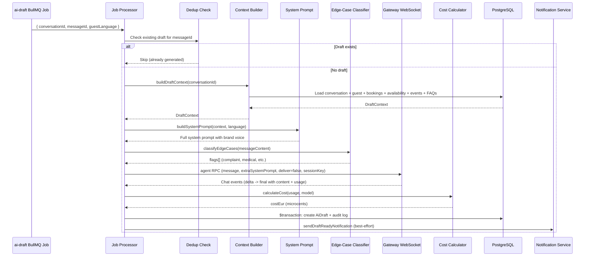
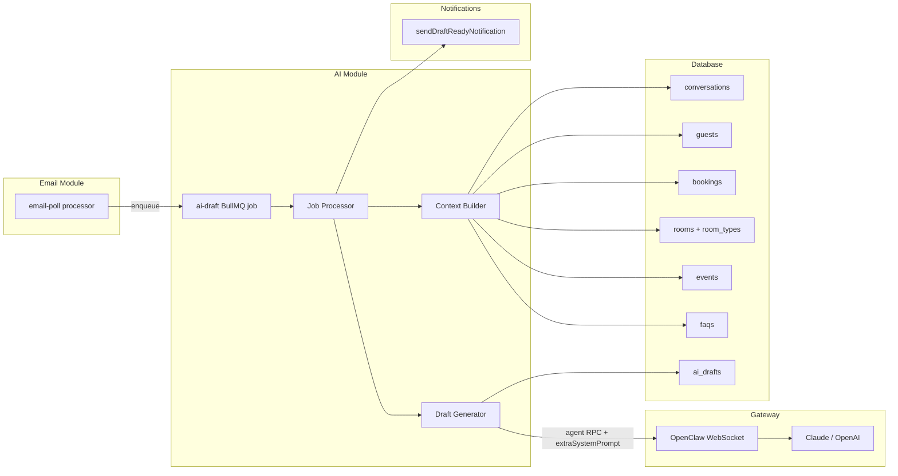

# AI Module Architecture

## Overview

The AI module generates context-rich email draft replies for guest inquiries. When a new guest email arrives, the email module enqueues an `ai-draft` BullMQ job. The AI module then loads the full business context (guest CRM data, booking history, room availability, upcoming events, FAQs), assembles a system prompt with brand voice guidelines and guardrails, calls the OpenClaw Gateway via a persistent WebSocket `agent` RPC, classifies the inbound message for edge cases (complaints, medical, dietary, cancellation, adoption), calculates the token cost in EUR microcents, and writes the draft to the database for Ines to review in the inbox UI.

All AI calls go through the self-hosted OpenClaw Gateway -- no direct LLM SDK imports in the backend. The Gateway handles Claude (primary) and OpenAI (fallback) provider failover internally.

## Data Flow



## File Structure

```
services/ai/
├── index.ts                    # Module entry point: AiModuleContract factory
├── context-builder.ts          # Aggregates business data into DraftContext
├── draft-generator.ts          # Orchestrates WebSocket agent call, cost calc, DB write
├── classifier.ts               # Pattern-based edge-case detection (EN/DE)
├── cost-calculator.ts          # Token-to-EUR microcent conversion with model pricing
├── ai-engine.ts                # Legacy placeholder (pre-OpenClaw direct SDK approach)
├── prompts/
│   ├── system.ts               # Brand voice prefix, guardrails, prompt assembly
│   └── classification.ts       # Reserved LLM classification prompt (unused -- pattern-based)
├── providers/
│   ├── anthropic.ts            # Placeholder (LLM calls go through OpenClaw Gateway)
│   └── openai.ts               # Placeholder (LLM calls go through OpenClaw Gateway)
└── __tests__/                  # Unit and integration tests
```

## Key Components

| File | Purpose | Key Functions | Notes |
|------|---------|---------------|-------|
| `index.ts` | Module factory implementing `AiModuleContract` | `createAiModule()` -> `{ generateDraft, classifyMessage, healthCheck }` | Thin wrapper delegating to `draft-generator.ts` and `classifier.ts`; health check uses Gateway WebSocket connection state |
| `context-builder.ts` | Aggregates business data for draft generation | `buildDraftContext(prisma, conversationId)` | Loads: conversation messages, guest profile, booking history, 90-day availability per room type, 30-day upcoming events with registration counts, all FAQ entries |
| `draft-generator.ts` | Orchestrates the full draft generation flow | `generateDraft(params)` | Steps: build context -> assemble prompt -> classify edge cases -> WebSocket `agent` RPC -> calculate cost -> DB write in transaction; unique session key per draft (`draft:{convId}:{timestamp}`) |
| `classifier.ts` | Pattern-based edge-case detection | `classifyEdgeCases(content)` | 5 categories: complaint, medical, dietary, cancellation, adoption; bilingual EN/DE patterns; zero LLM cost; returns array of matching flags |
| `cost-calculator.ts` | Token usage to EUR cost conversion | `calculateCost(usage, model)`, `formatCostEur(microcents)` | Model pricing table with prefix matching (sorted longest-first); handles prompt cache read/write tokens; USD-to-EUR conversion at fixed rate; returns integer microcents (EUR * 100,000) |
| `prompts/system.ts` | System prompt assembly | `buildSystemPrompt(context, language)`, `BRAND_VOICE_PREFIX` | 5449-char brand voice prefix exceeds Anthropic 1024-token prompt caching minimum; includes guardrails, guest profile, booking history, availability, events, FAQs, language instruction |
| `prompts/classification.ts` | Reserved LLM classification prompt | `CLASSIFICATION_PROMPT`, `formatClassificationContext()` | Not used in production -- pattern-based `classifier.ts` handles all classification; kept for potential future LLM-enhanced classification |
| `providers/anthropic.ts` | Anthropic SDK placeholder | (empty export) | Direct SDK calls replaced by OpenClaw Gateway in Phase 10 |
| `providers/openai.ts` | OpenAI SDK placeholder | (empty export) | Direct SDK calls replaced by OpenClaw Gateway in Phase 10 |

## Configuration

### Environment Variables

| Variable | Purpose | Notes |
|----------|---------|-------|
| `ANTHROPIC_API_KEY` | Claude API key | Configured in OpenClaw Gateway, not used directly by backend |
| `OPENAI_API_KEY` | OpenAI API key (fallback) | Configured in OpenClaw Gateway, not used directly by backend |
| `AI_DEFAULT_MODEL` | Default model for draft generation | e.g., `claude-sonnet-4-5-20250929`; used in Gateway config |

### Constants

| Constant | Value | Location | Purpose |
|----------|-------|----------|---------|
| `BRAND_VOICE_PREFIX` | ~5449 chars | `prompts/system.ts` | Static brand voice; exceeds Anthropic 1024-token prompt caching minimum |
| `GUARDRAILS` | ~1200 chars | `prompts/system.ts` | 7 safety rules (no price commitments, no medical advice, no specific puppies, etc.) |
| `MAX_MESSAGES` | 20 | `draft-generator.ts` | Maximum conversation messages included in prompt context |
| `USD_TO_EUR` | 0.92 | `cost-calculator.ts` | Fixed conversion rate for cost calculation |
| `MODEL_PRICING` | Map | `cost-calculator.ts` | Per-model token pricing (claude-sonnet-4-5, claude-haiku-3-5, gpt-4o, gpt-4o-mini) |

## Cross-Module Communication



| Direction | Target | Mechanism | When |
|-----------|--------|-----------|------|
| Email -> AI | `ai-draft` BullMQ queue | Job enqueued by email pipeline after `guest_inquiry` message stored | New inbound guest email |
| AI -> Gateway | WebSocket `agent` RPC | `gateway.request('agent', { message, extraSystemPrompt, deliver: false, sessionKey })` | Draft generation |
| AI -> Database | Prisma `$transaction` | `aiDraft.create()` + `writeAuditLog()` | After successful generation |
| AI -> Notifications | `sendDraftReadyNotification()` | Best-effort call from job processor | After draft stored in DB |

## Cost Tracking

### How Costs Are Calculated

1. **Token usage** extracted from Gateway response: `prompt_tokens`, `completion_tokens`, `cache_read_input_tokens`, `cache_creation_input_tokens`
2. **Provider prefix stripped**: OpenClaw returns model names like `anthropic/claude-sonnet-4-5-20250929` -- the `anthropic/` prefix is stripped before pricing lookup
3. **Prefix matching**: `MODEL_PRICING` keys are sorted by length descending so `gpt-4o-mini` matches before `gpt-4o`
4. **USD cost computed**: `(inputTokens * inputRate + outputTokens * outputRate + cacheTokens * cacheRates) / 1,000,000`
5. **Converted to EUR**: `totalUsd * 0.92`
6. **Stored as microcents**: `Math.round(totalEur * 100,000)` -- integer precision for 5 decimal places

### Pricing Table (as of 2026-02-20)

| Model | Input ($/MTok) | Output ($/MTok) | Cache Write | Cache Read |
|-------|----------------|-----------------|-------------|------------|
| claude-sonnet-4-5 | 3.00 | 15.00 | 3.75 | 0.30 |
| claude-haiku-3-5 | 0.80 | 4.00 | 1.00 | 0.08 |
| gpt-4o | 2.50 | 10.00 | -- | -- |
| gpt-4o-mini | 0.15 | 0.60 | -- | -- |

### Display

- `formatCostEur(microcents)` returns EUR string with 4 decimal places (e.g., "0.1235")
- Frontend displays with euro sign prefix (e.g., "EUR 0.1235")
- `tokensUsed` field stores `inputTokens + outputTokens` for backward compatibility with legacy drafts

## Edge-Case Classification

Pattern-based detection with zero LLM cost. Runs on every draft generation to flag sensitive messages for priority review.

| Category | English Patterns | German Patterns | UI Treatment |
|----------|-----------------|-----------------|-------------|
| `complaint` | unhappy, disappointed, terrible, refund, compensation | unzufrieden, enttaeuscht, schrecklich, erstattung | Destructive badge |
| `medical` | allerg*, medical, disability, wheelchair, medication | allergie, medizinisch, rollstuhl, medikament | Amber outline badge |
| `dietary` | vegan, gluten-free, celiac, lactose, nut allergy | glutenfrei, laktose, nussallergie | Amber outline badge |
| `cancellation` | cancel, can't make it, change dates, reschedule | stornieren, absagen, umbuchen, verschieben | Destructive badge |
| `adoption` | adopt, take home, keep the puppy | adoptieren, mitnehmen, behalten | Amber outline badge |

Messages matching edge cases still receive AI drafts but are marked as "sensitive -- review carefully" in the logs and flagged in the inbox UI.

## Error Handling

| Failure | Strategy | Impact |
|---------|----------|--------|
| Gateway unavailable | Draft generation fails; BullMQ retries 3x with exponential backoff from 3s | Draft delayed; if all retries fail, `onFailed` handler writes empty `status: 'failed'` record for frontend detection |
| Context builder failure | Error propagates to job processor; BullMQ retry | Draft generation retried |
| Cost calculation: unknown model | Returns 0 cost, logs warning in production | Draft still generated, cost shows as zero |
| Empty Gateway response | `generateDraft` throws "Gateway returned empty response" | BullMQ retry |
| Notification failure | Best-effort try/catch; logged but never blocks | Draft still stored, WhatsApp notification not sent |
| Duplicate draft check | Skips generation if pending/failed draft already exists for messageId | Prevents duplicate drafts from BullMQ retries or re-enqueued jobs |

### Failed Draft Detection

When all BullMQ retries are exhausted, `createAiDraftFailedHandler` writes a record:
```
{ conversationId, messageId, content: '', status: 'failed', model: 'none', tokensUsed: 0 }
```
The frontend polls for draft status and surfaces a "Draft generation failed" notice with a "Generate new draft" button.

## Decision Log

| Phase | Decision | Rationale |
|-------|----------|-----------|
| 04-01 | Agent API uses same auth (JWT + API key) | OpenClaw authenticates via PYR_API_KEY |
| 04-02 | Pattern-only classification (no LLM) for edge-cases | Zero cost, instant, sufficient for EN/DE keyword detection |
| 04-02 | Cost stored as EUR microcents (EUR * 100,000) | 5 decimal places of precision for per-call tracking |
| 04-02 | `MODEL_PRICING` prefix matching sorted longest-first | Prevents `gpt-4o` matching `gpt-4o-mini` |
| 04-02 | `BRAND_VOICE_PREFIX` at 5449 chars | Exceeds Anthropic 1024-token prompt caching minimum |
| 04-03 | Provider-prefixed model names stripped before cost calculation | OpenClaw returns `anthropic/model-name` format |
| 04-03 | BullMQ job processor deduplicates by checking existing pending draft per message | Prevents duplicate drafts from retries |
| 04-03 | `healthCheck` uses Gateway reachability as proxy for provider health | Gateway handles failover internally |
| 05-01 | Per-message dedup (not per-conversation) in AI draft job | Each inbound message gets its own draft |
| 05-01 | `onFailed` handler writes empty failed record for frontend detection | UI can show failure and offer retry |
| 05-02 | All FAQs injected into every prompt | LLM naturally selects relevant ones (10-50 entries within token limits) |
| 10-03 | Unique session key per draft (`draft:{convId}:{timestamp}`) | Isolates concurrent draft generation jobs on shared WebSocket |
| 10-03 | `extraSystemPrompt` injects full business context into agent RPC | Replaces HTTP system prompt message approach |
| 10-03 | `deliver: false` on agent RPC | Ensures drafts are never auto-sent to WhatsApp |

---
*Module: services/ai*
*Phases: 4 (AI Communication Engine), 5 (AI-Email Integration), 10 (WebSocket Migration)*
*Last updated: 2026-02-23*
