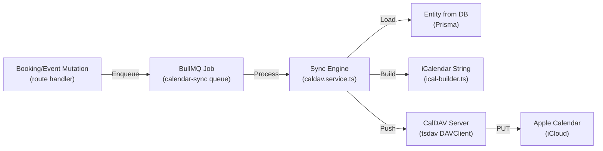

# CalDAV Calendar Sync Architecture

## Overview

One-way push from PYR database to Apple Calendar via CalDAV protocol. Bookings and events are synced on create, update, and delete. Uses the [tsdav](https://github.com/natelindev/tsdav) library for CalDAV operations and [ical-generator](https://github.com/sebbo2002/ical-generator) for iCalendar (RFC 5545) output.

**Business rule:** Data flows ONE WAY -- DB to Apple Calendar. Never read from CalDAV to update DB.

## Data Flow



**Three sync actions:**

| Action | CalDAV Operation | Calendar Effect |
|--------|-----------------|-----------------|
| `create` | PUT new `.ics` file | New VEVENT appears |
| `update` | PUT replace `.ics` with incremented SEQUENCE | VEVENT content updated |
| `delete` | PUT with `[CANCELLED]` title prefix | Event shows as cancelled (not removed) |

## File Structure

```
src/services/caldav/
  index.ts              # Module entry point -- factory returning CalendarModuleContract
  caldav.client.ts      # Lazy singleton DAVClient with cache reset on config change
  caldav.service.ts     # Sync engine -- load entity, build iCal, push via CalDAV
  ical-builder.ts       # iCalendar VEVENT builders for bookings and events
  __tests__/            # Unit and integration tests
```

## Key Components

### caldav.client.ts -- CalDAV Connection Manager

Lazy singleton `DAVClient` that connects to iCloud CalDAV. Credentials are resolved from the Settings table (encrypted) with environment variable fallback.

- `getCaldavConfig(prisma)` -- Loads CalDAV credentials. Settings table first (encrypted password via `decrypt()`), then `CALDAV_URL`/`CALDAV_USER`/`CALDAV_PASS` env vars.
- `getCaldavClient(prisma)` -- Returns cached `{ client, calendar }`. On first call: creates DAVClient, logs in, discovers calendars by `displayName`, caches both. Throws descriptive errors on login failure or missing calendar.
- `resetCaldavClient()` -- Clears cached client and calendar. Called when admin saves new CalDAV credentials via the Settings UI, forcing reconnection with updated credentials on the next sync operation.

### ical-builder.ts -- iCalendar Event Builders

Builds RFC 5545 compliant iCalendar strings using `ical-generator`.

**Constants:**
- `VILLA_ADDRESS` = `'Puppy Yoga Retreat, Peyia 8560, Paphos, Cyprus'`
- `TIMEZONE` = `'Europe/Nicosia'`
- `EVENT_DURATIONS` -- `puppy_yoga: 90min`, `beach_walk: 120min`, `coffee_cake_cuddles: 60min`

**`buildBookingVevent(params)`** -- All-day VEVENT for bookings:
- SUMMARY: `"Guest Name -- Room Name"` (or `"[CANCELLED] Guest Name -- Room Name"`)
- DTSTART: check-in date
- DTEND: check-out date + 1 day (RFC 5545 non-inclusive DTEND rule for DATE values)
- DESCRIPTION: guest email, phone, room, total price with payment status, booking source
- LOCATION: villa address

**`buildEventVevent(params)`** -- Timed VEVENT for standalone events:
- SUMMARY: `"Puppy Yoga (5/8 booked)"` (or `"[CANCELLED] ..."`)
- DTSTART: event date + parsed time
- DTEND: DTSTART + duration from `EVENT_DURATIONS` mapping
- DESCRIPTION: list of registered guest names
- LOCATION: event-specific location (RFC 5545 comma escaping handled by ical-generator)
- TIMEZONE: Europe/Nicosia

### caldav.service.ts -- Sync Engine

Job processor for `calendar-sync` BullMQ jobs. Two main functions:

**`syncBookingToCalendar(app, bookingId, action)`:**
1. Load booking with guest, room (including roomType), and calendarEvents relations
2. Create or find existing `CalendarEvent` record (tracks caldavUid, caldavUrl, etag, sequence)
3. Build iCalendar string via `buildBookingVevent()`
4. On create: `client.createCalendarObject()` -- extract etag from response, store caldavUrl
5. On update: `client.updateCalendarObject()` -- increment SEQUENCE, use stored etag
6. On delete: same as update but with `[CANCELLED]` title prefix
7. Update `CalendarEvent.syncStatus` to `'synced'` or `'failed'` with error message

**`syncEventToCalendar(app, eventId, action)`:**
- Same pattern as booking sync but loads event with confirmed eventBookings for registration count and guest names.

### index.ts -- Module Entry Point

Factory function `createCaldavModule(app)` returning `CalendarModuleContract`:
- `syncBooking(bookingId, action)` -- delegates to `syncBookingToCalendar`
- `syncEvent(eventId, action)` -- delegates to `syncEventToCalendar`
- `healthCheck()` -- attempts `getCaldavClient()`, returns `{ caldav: true/false }`

## Configuration

| Source | Key / Variable | Description |
|--------|---------------|-------------|
| Settings table | `caldav_provider` | JSON object: `{ serverUrl, username, encryptedPassword, calendarName }` |
| Env fallback | `CALDAV_URL` | CalDAV server URL (default: `https://caldav.icloud.com`) |
| Env fallback | `CALDAV_USER` | Apple ID / CalDAV username |
| Env fallback | `CALDAV_PASS` | App-specific password |

Settings table uses the same encrypted password pattern as `email_provider` (Phase 03-02). Passwords are encrypted via `lib/encryption.ts` using a key derived from `JWT_SECRET` via scrypt.

## Cross-Module Communication

| Trigger | Source | Mechanism | Notes |
|---------|--------|-----------|-------|
| Booking create/update | `booking.routes.ts` | `calendar-sync` BullMQ job | Enqueued in route handler (not service) |
| Booking cancel | `booking.routes.ts` | `calendar-sync` job with `action: 'delete'` | Prefixes title with [CANCELLED] |
| Event create/update | `event.routes.ts` | `calendar-sync` BullMQ job | Includes registration count refresh |
| Event delete | `event.routes.ts` | Synchronous `syncEventToCalendar()` | Must run before DB cascade delete |
| OTA booking | Email pipeline | `calendar-sync` job after auto-creation | OTA parser creates booking then enqueues sync |
| CalDAV config change | `settings.routes.ts` | `resetCaldavClient()` | Forces reconnection with new credentials |

**Why event delete is synchronous:** Events use hard delete with DB cascade (deletes `event_bookings` and `calendar_events`). An async BullMQ job would find the entity already deleted. The sync runs synchronously before the DELETE to push `[CANCELLED]` prefix while data is still available.

## iCalendar Format Details

### Booking VEVENT (all-day)

```
BEGIN:VEVENT
UID:pyr-booking-<calendarEventId>
DTSTART;VALUE=DATE:20260315
DTEND;VALUE=DATE:20260320       # checkOut + 1 day (RFC 5545 non-inclusive)
SUMMARY:Anna Mueller -- Panorama Suite (Suite A)
DESCRIPTION:Email: anna@example.com\nPhone: +49...\nRoom: ...\nTotal: EUR 450.00 (Unpaid)\nSource: website
LOCATION:Puppy Yoga Retreat\, Peyia 8560\, Paphos\, Cyprus
SEQUENCE:0
END:VEVENT
```

### Event VEVENT (timed)

```
BEGIN:VEVENT
UID:pyr-event-<calendarEventId>
DTSTART;TZID=Europe/Nicosia:20260315T100000
DTEND;TZID=Europe/Nicosia:20260315T113000    # 90 min for puppy_yoga
SUMMARY:Puppy Yoga (5/8 booked)
DESCRIPTION:Registered guests:\n- Anna Mueller\n- Thomas Weber
LOCATION:Rooftop
SEQUENCE:0
END:VEVENT
```

## Error Handling

| Scenario | Behavior |
|----------|----------|
| CalDAV server unreachable | Job fails, BullMQ retries with backoff |
| Invalid credentials | `getCaldavClient()` throws, logged, job fails |
| Calendar not found by name | `getCaldavClient()` throws with available calendar list |
| Entity not found in DB | Skip sync, log warning (entity may have been deleted) |
| CalDAV PUT fails | `syncStatus` set to `'failed'`, `lastError` recorded, error re-thrown for BullMQ retry |
| Stale etag (409 Conflict) | tsdav propagates error, BullMQ retries with fresh data |

## Troubleshooting

- **iCloud CalDAV endpoint:** Apple uses `https://caldav.icloud.com` but the actual calendar home may differ per account. The tsdav library handles discovery via `.well-known/caldav`.
- **End-date off-by-one:** If a 4-night stay (Mar 15-19) shows as 3 nights in Apple Calendar, the +1 day adjustment for non-inclusive DTEND may not be applied. Check `ical-builder.ts` `endDate.setDate()` logic.
- **[CANCELLED] events still visible:** By design. Cancelled bookings/events are not removed from the calendar -- they get a `[CANCELLED]` title prefix so Ines can see the history.
- **Stale client after credential change:** If syncs fail after updating CalDAV settings, verify `resetCaldavClient()` is called by the settings save handler. The cached client must be cleared for new credentials to take effect.
- **Calendar sync status:** The admin dashboard shows a sync status banner polling `/api/v1/calendar/status` every 60 seconds. Failed syncs appear with error messages.

## Decision Log

| Decision | Rationale |
|----------|-----------|
| CalDAV credentials in Settings table (encrypted) | Same pattern as email provider. Admin-configurable via UI. Env var fallback for initial setup. |
| All-day booking DTEND = checkOut + 1 day | RFC 5545 specifies non-inclusive DTEND for DATE values. Without +1, a 4-night stay would show as 3 days in Apple Calendar. |
| Event durations from type mapping (no DB field) | Three fixed event types with known durations. Simpler than adding a `duration` column. Falls back to 60 min for unknown types. |
| Cancelled events get [CANCELLED] prefix, not deleted | Ines wants to see cancellation history in the calendar. Hard-deleting from CalDAV would lose this visibility. |
| Sync job enqueued in routes, not services | Keeps services pure (no queue dependency). Same pattern as AI draft enqueueing. |
| Event DELETE syncs synchronously before hard-delete | DB cascade prevents async approach -- the entity and CalendarEvent would be gone by the time BullMQ processes the job. |
| Payment status uses simple heuristic | `totalPrice > 0 = Unpaid` for MVP. No payment model queries until Phase 2. |
| CalDAV client cached as lazy singleton | Avoids re-authentication on every sync. `resetCaldavClient()` handles credential changes. |

---

*Module: CalDAV Calendar Sync (Phase 06)*
*Contract: `CalendarModuleContract` from `@pyr/shared`*
