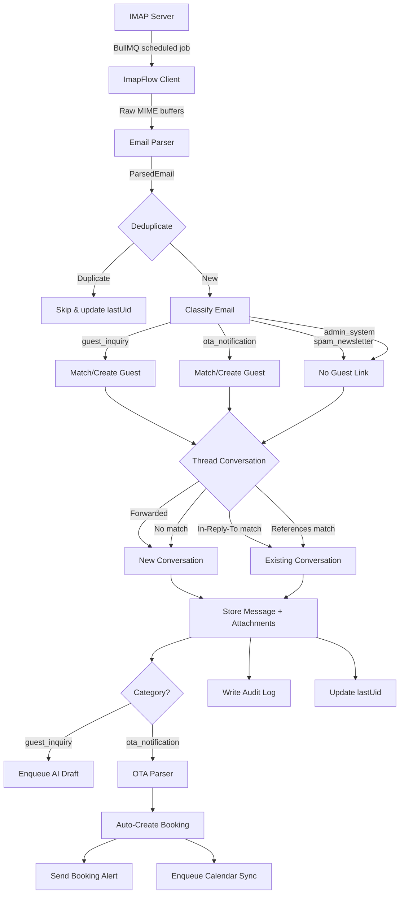
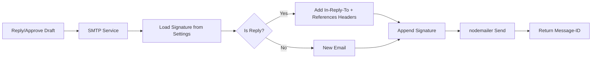
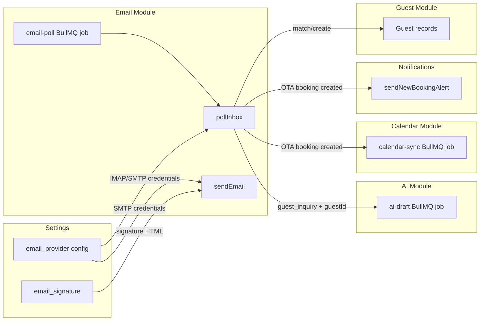

# Email Module Architecture

> Note: Inbox ingestion behavior was reworked in March 2026. For the current
> OpenClaw-driven classification and customer-link flow, see
> `docs/inbox-openclaw-rework.md`.

## Overview

The email module is the primary inbound communication pipeline for Puppy Yoga Retreat. It handles the complete lifecycle of email processing: polling IMAP for new messages, parsing MIME content with sanitization, deduplicating by Message-ID, classifying emails into categories (guest inquiry, OTA notification, spam, system), matching senders to CRM guest records, threading conversations using RFC 5322 headers (In-Reply-To, References), storing messages with attachments, and triggering downstream actions -- AI draft generation for guest inquiries and automatic booking creation for OTA notifications.

The outbound path provides SMTP sending with threading header preservation, configurable email signatures, and lazy transporter re-creation when credentials change. The module follows the integration module pattern: it receives `email-poll` BullMQ jobs on a configurable schedule and produces `ai-draft` and `calendar-sync` jobs for other modules.

## Data Flow

### Inbound Pipeline



### Outbound Flow



## File Structure

```
services/email/
├── index.ts                    # Module entry point: factory, pollInbox, sendEmail, healthCheck
├── imap.service.ts             # IMAP client: connect-per-poll, UID-based fetching, 100-msg cap
├── email-parser.ts             # MIME parsing (mailparser) + HTML sanitization (sanitize-html)
├── email-threader.ts           # Conversation threading via In-Reply-To/References headers
├── email-classifier.ts         # Rules-based email classification (OTA, spam, system, guest)
├── contact-matcher.ts          # Guest CRM matching by email, auto-creation with language detection
├── smtp.service.ts             # SMTP sending with threading headers and signature injection
├── language-detector.ts        # EN/DE detection via franc-min trigram analysis
├── ota-parser.ts               # OTA parser registry (strategy pattern)
├── ota-parsers/
│   ├── index.ts                # Parser registration entry point
│   └── tripaneer.parser.ts     # Tripaneer/BookYogaRetreats extraction (multi-strategy)
└── __tests__/                  # Unit and integration tests
```

## Key Components

| File | Purpose | Key Functions | Notes |
|------|---------|---------------|-------|
| `index.ts` | Module factory implementing `EmailModuleContract` | `createEmailModule()`, `pollInbox()`, `sendEmail()`, `healthCheck()`, `startPolling()`, `stopPolling()` | Lazy SMTP service with config-change detection; resolves config from settings table with env var fallback |
| `imap.service.ts` | IMAP connection and message fetching | `createImapService()`, `pollNewEmails()` | Connect-per-poll strategy (fresh ImapFlow client each cycle); 100-message cap per poll; UID `N:*` search with post-filter |
| `email-parser.ts` | MIME parsing and HTML sanitization | `parseEmail()`, `sanitizeEmailHtml()` | Uses `mailparser.simpleParser`; strict allowlist sanitization (http/https/mailto only); extracts attachments as Buffers |
| `email-threader.ts` | RFC 5322 conversation threading | `findConversationByHeaders()`, `buildReferencesChain()`, `isForwardedEmail()` | Checks In-Reply-To first, then References newest-first; forwards (Fwd:/Fw:) always create new conversations; chain capped at 20 |
| `email-classifier.ts` | Rules-based email categorization | `classifyEmail()`, `isSystemSender()` | Priority order: OTA domains (0.95) > system senders (0.9) > spam patterns (0.8) > default guest_inquiry (0.6) |
| `contact-matcher.ts` | Guest CRM record matching/creation | `matchOrCreateGuest()` | Only creates guests for `guest_inquiry` category; uses language detection; transaction with audit log |
| `smtp.service.ts` | SMTP email sending | `createSmtpService()`, `sendReply()`, `sendNew()`, `verifyConnection()` | Preserves threading headers; auto-prefixes "Re: "; caps References at 20; appends configurable signature |
| `language-detector.ts` | EN/DE language detection | `detectLanguage()` | Uses `franc-min` (trigram); restricted to English/German; defaults to 'en' for short text (<20 chars) |
| `ota-parser.ts` | Strategy pattern parser registry | `registerOtaParser()`, `parseOtaEmail()` | Iterates registered parsers; first `canParse()` match wins; returns `OtaBookingData` or null |
| `tripaneer.parser.ts` | Tripaneer/BookYogaRetreats parser | `tripaneerParser.canParse()`, `.parse()` | Multi-strategy extraction: label-based regex with fallback patterns; extracts guest, dates, price, reference ID; `needsReview` flag for missing critical fields |

## Configuration

The email module supports two configuration sources, checked in order:

### 1. Settings Table (Primary)

Encrypted email provider config stored in the `settings` table under the key `email_provider`. Managed via the admin Settings UI.

| Setting Key | Type | Description |
|-------------|------|-------------|
| `email_provider` | Encrypted JSON | `{ email, password, imapHost, imapPort, smtpHost, smtpPort, pollIntervalMinutes, pollingEnabled }` |
| `imap_last_uid` | Integer | Last processed IMAP UID for incremental polling |
| `email_poll_interval_ms` | Integer | Override poll interval (minimum 30s) |
| `email_signature` | String or `{ html: string }` | Outbound email signature (supports Tiptap HTML) |

### 2. Environment Variables (Fallback)

Used when settings table config is not available (e.g., first run before admin setup).

| Variable | Default | Description |
|----------|---------|-------------|
| `IMAP_HOST` | `imap.gmx.net` | IMAP server hostname |
| `IMAP_PORT` | `993` | IMAP server port (TLS) |
| `SMTP_HOST` | `mail.gmx.net` | SMTP server hostname |
| `SMTP_PORT` | `587` | SMTP server port (STARTTLS) |
| `EMAIL_USER` | (none) | Email account username |
| `EMAIL_PASS` | (none) | Email account password |

### Polling Schedule

- Default interval: 120 seconds (2 minutes)
- Minimum interval: 30 seconds (enforced)
- Controlled by: `email_provider.pollIntervalMinutes` in settings, overridden by `email_poll_interval_ms`
- Can be disabled via `pollingEnabled: false` in the email provider config

## Cross-Module Communication



| Direction | Target | Mechanism | When |
|-----------|--------|-----------|------|
| Email -> AI | `ai-draft` BullMQ queue | `app.queues.getQueue(QUEUE_NAMES.AI_DRAFT).add()` | After storing a `guest_inquiry` message with a linked guest |
| Email -> Calendar | `calendar-sync` BullMQ queue | `app.queues.getQueue(QUEUE_NAMES.CALENDAR_SYNC).add()` | After OTA booking auto-creation |
| Email -> Notifications | `sendNewBookingAlert()` direct call | Fire-and-forget `.catch()` | After OTA booking auto-creation |
| Email -> Guest | Prisma `guest.findFirst` / `guest.create` | Direct DB via `contact-matcher.ts` | During each inbound email processing |
| Settings -> Email | `getEmailProviderConfig()` | Called on each poll and send | SMTP transporter lazily recreated when config changes |

## OTA Parsing Subsystem

The OTA parser uses a **strategy pattern with a registry**:

1. **Registry** (`ota-parser.ts`): Maintains an array of `OtaParser` implementations. `parseOtaEmail()` iterates parsers and returns the first match.

2. **Tripaneer Parser** (`tripaneer.parser.ts`): Handles both Tripaneer and BookYogaRetreats (same parent platform). Uses multi-strategy field extraction:
   - **Label-based regex**: Searches for "Label: Value" patterns (e.g., "Guest name: Anna Schmidt")
   - **Fallback patterns**: Email regex, price regex, date format detection
   - **Domain matching**: `tripaneer.com`, `bookyogaretreats.com`

3. **Auto-booking creation** (in `index.ts`): When an OTA email is parsed:
   - Guest matched by email, then name, then auto-created
   - First available room assigned (Ines reassigns later)
   - Dates parsed or placeholder today/tomorrow used
   - `needsReview: true` flagged when critical fields are missing
   - Uses direct Prisma calls (not booking service) to avoid validation rejection of incomplete data

### Adding a New OTA Parser

1. Create `ota-parsers/<platform>.parser.ts` implementing `OtaParser` interface
2. Implement `canParse(fromAddress, subject)` for domain/subject matching
3. Implement `parse(html, text, subject)` returning `OtaBookingData`
4. Register in `ota-parsers/index.ts`: `registerOtaParser(newParser)`

## Email Threading

RFC 5322 compliant threading ensures email conversations display correctly in Gmail, Outlook, and Apple Mail.

### Inbound Threading

1. **In-Reply-To** checked first (most reliable) -- find message by `messageId` field
2. **References** checked in reverse order (newest first) -- most recent ancestor is most likely match
3. **Forwarded emails** (`Fwd:` / `Fw:` prefix) always create new conversations
4. **No match** creates a new conversation

### Outbound Threading

1. `In-Reply-To` set to the message being replied to
2. `References` chain built from existing chain + new message ID
3. Chain capped at 20 entries (oldest dropped) to prevent unbounded header growth
4. Subject auto-prefixed with `Re:` if not already present

## Error Handling

| Failure | Strategy | Impact |
|---------|----------|--------|
| IMAP connection failure | Connect-per-poll strategy means next poll gets a fresh client | Single poll cycle missed; next cycle retries automatically |
| IMAP fetch failure (single message) | Log error, continue processing remaining messages | One email skipped, others processed normally |
| SMTP send failure | No retry in SMTP service; caller or BullMQ handles retries | Caller receives thrown error; BullMQ retry for queued sends |
| Email parser failure | Log and skip that email, continue batch | One email skipped; `lastUid` NOT updated so it will be retried |
| OTA parsing failure | Log warning, email still stored as conversation | Booking not auto-created; Ines sees email and can create manually |
| AI draft enqueue failure | Try/catch wraps enqueue; failure never blocks email processing | Draft not generated; Ines can manually reply |
| Duplicate Message-ID | Skip silently, update `lastUid` to avoid re-fetch | Deduplication via partial unique index on `message.messageId` |
| Alert send failure | Fire-and-forget `.catch()` -- never blocks | WhatsApp notification not sent; booking still created |

### Key Design Principle

Each email is processed independently within the batch loop. One email failing does not prevent others from being processed. The `try/catch` wraps each email in the `for (const raw of rawEmails)` loop.

## Troubleshooting

### Stale IMAP Connections

**Problem:** GMX and some IMAP providers close idle connections silently.
**Solution:** Connect-per-poll strategy -- a fresh `ImapFlow` client is created for each poll cycle. No persistent connections to go stale.

### 100-Message Cap Per Poll

**Problem:** First sync on a large inbox could consume too much memory.
**Solution:** `MAX_FETCH_PER_POLL = 100` caps each poll. Messages are processed oldest-first chronologically. Remaining messages are fetched in subsequent polls via the `lastUid` marker.

### IMAP UID Search Quirk

**Problem:** IMAP `N:*` search always returns at least UID N, even when no newer messages exist.
**Solution:** Post-filter `uids.filter((uid) => uid > lastUid)` after the IMAP search to remove the false positive.

### Duplicate Conversations for Forwarded Emails

**Problem:** Forwarded emails may contain References headers from the original thread.
**Solution:** Subject prefix check (`Fwd:` / `Fw:`) forces new conversation creation, ignoring threading headers.

### Partial Unique Index on message_id

**Problem:** Not all messages have a Message-ID (e.g., draft messages, manual entries).
**Solution:** Partial unique index `WHERE message_id IS NOT NULL` allows deduplication for emails while permitting null values for other message types.

### Email Signature Format

**Problem:** Signature may be stored as plain string, `{ html: string }`, or `{ text: string }`.
**Solution:** `sendEmail()` checks all three formats with graceful fallback to a default signature.

## Decision Log

Key architectural decisions from project phases:

| Phase | Decision | Rationale |
|-------|----------|-----------|
| 02-01 | Connect-per-poll IMAP strategy | Fresh ImapFlow client each cycle avoids stale GMX connections |
| 02-01 | Partial unique index on `message_id` WHERE NOT NULL | Email deduplication without affecting non-email messages |
| 02-01 | 100-message cap per IMAP poll | Prevents memory issues on initial large inbox sync |
| 02-01 | `Conversation.guestId` nullable | OTA/spam/system emails stored without guest linkage |
| 02-02 | `sanitize-html` strict allowlist | Only http/https/mailto schemes; blocks javascript:/data: URLs |
| 02-02 | References checked newest-first | Most recent ancestor is most likely match in DB |
| 02-02 | Forwarded emails force new conversation | Original thread context no longer applies after forwarding |
| 02-02 | References chain capped at 20 | Prevents unbounded header growth |
| 02-04 | No retry logic in SMTP service | Caller or BullMQ handles retries; service is send-and-report |
| 02-05 | Email module lazily initialized per job processor | Not per-poll; avoids redundant SMTP transporter creation |
| 02-05 | Email signature loaded from settings per outbound email | Configurable via admin UI |
| 03-01 | Attachment data stored as Bytes in PostgreSQL | Avoids external file storage complexity for MVP |
| 03-01 | `isRead` defaults to `true` on Conversation | Existing conversations don't retroactively appear unread |
| 03-02 | SMTP service lazily recreated only when config changes | Avoids redundant transporter creation |
| 03-03 | OTA parser uses strategy pattern with registry | New platforms added by implementing OtaParser interface |
| 03-03 | Multi-strategy extraction: label-based regex with fallback | Handles varying OTA email formats |
| 03-03 | OTA booking uses direct Prisma (not booking service) | Avoids validation rejection of incomplete bookings |
| 03-03 | Placeholder dates when OTA email lacks check-in/check-out | `needsReview=true` alerts Ines to fix |

---
*Module: services/email*
*Phase: 2 (Email Ingestion Pipeline), 3 (Email UI & OTA Parsing)*
*Last updated: 2026-02-23*
